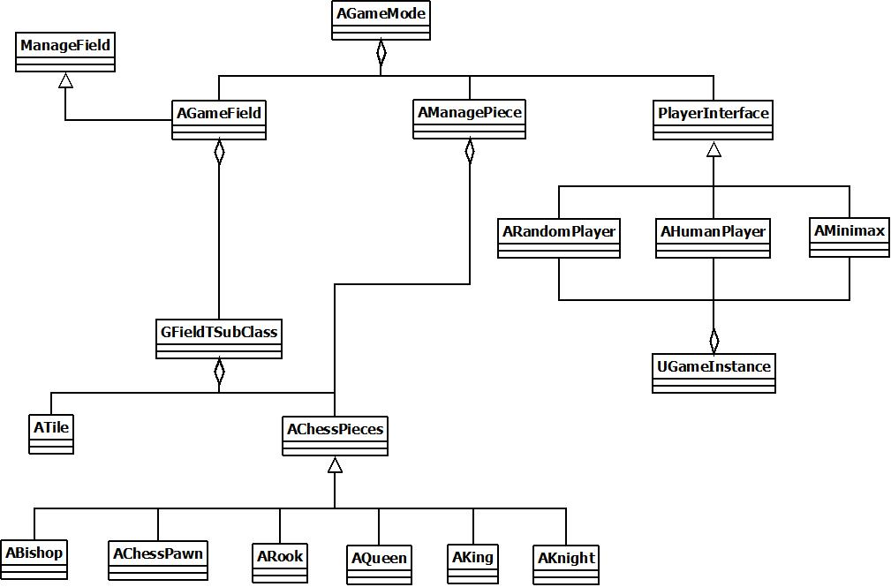
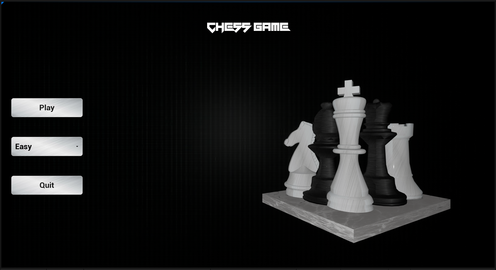

# Chess
Chess game developed in unreal engine 5.2

### What you can do
The game opens with a menu where the player can choose the difficulty.   
There are two difficulties:  
- Easy: AI player randomly chooses the play
- Hard: AI player chooses the best play among those possible (minimax algorithm)

There is also a replay function and during the game you can decide whether to start a new game or return to the menu

All moves have been implemented except the En passant

### How
Unreal Engine 5.2
- Game logic: c++
- Graphics: blueprints

### Usage
1) git clone {.git}
2) From *Chess.uproject* generate Visual Studio project files
3) Compile the project
4) Open *Chess.uproject*

### UML

### Menu

### Game

### Replay

