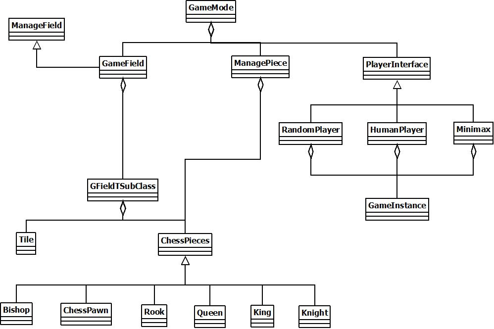

# Chess
Chess game developed in unreal engine 5.2

### What you can do
The game opens with a menu where the player can choose the difficulty.   

There are two main difficulties:  
- Easy: AI player randomly chooses the play
- Hard: AI player chooses the best play among those possible (minimax algorithm)

There are three other demonstration modes:
- random-random: two AI players who compete by choosing moves randomly
- random-minimax: two AI players, one chooses the moves randomly, the other chooses the best possible move
- minimax-minimax: two AI players who compete by choosing the best possible move

The match results are saved in a csv file, in the */Game_Data/CSV* directory,  
while a statistic based on that data is present in an Excel file in the */Game_Data/Statistics* directory.  
The statistics are calculated with a python script. 

There is also a replay function and during the game you can decide whether to start a new game or return to the menu

All moves have been implemented except the En passant

### How
Unreal Engine 5.2
- Game logic: c++
- Graphics: blueprints
- Statistics: python

### Usage
#### - Game
1) git clone {.git}
2) From *Chess.uproject* generate Visual Studio project files
3) To test the game start the *Chess.uproject* file
#### - Statistics
1) To run the python script from terminal, on Linux, connect to the */Game_Data/Statistics* directory and run: ```python3 Chess_Statistics.py```

### UML

<hr>

### Menu

<hr>

### Game


